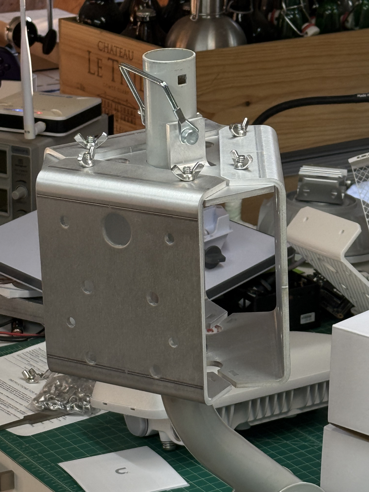

# Outdoor Mobile Hotspot 3x Mount

Manufactured by SendCutSend.
Not modeled, but required for these to fit together are 6x 1/4-20 by 0.750" flush studs, set facing upward in the direction of the bend. 

Also used:
- 1/4-20 wing nuts (https://www.amazon.com/dp/B0CCDHJ7ZW)
- 2.75" trailer hitch pin (https://www.amazon.com/dp/B0D6BWQCB2)
- Ubiquiti UB-AM j-pole antenna mount (https://store.ui.com/us/en/products/universal-antenna-mount)
- [Optional] Outdoor zip ties for fastening plates on bottom (https://www.amazon.com/dp/B0BRXZ9RQG)

View the file directly on Autodesk's viewer at https://a360.co/44ce8xs.

