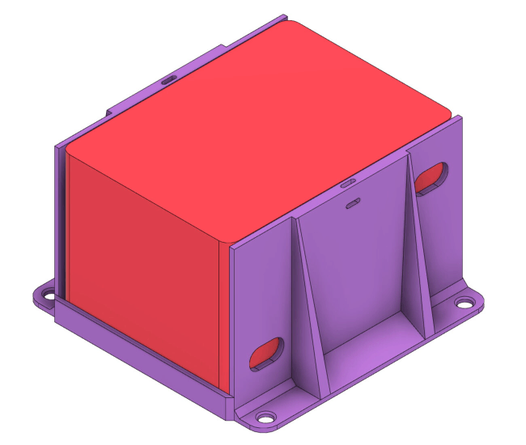
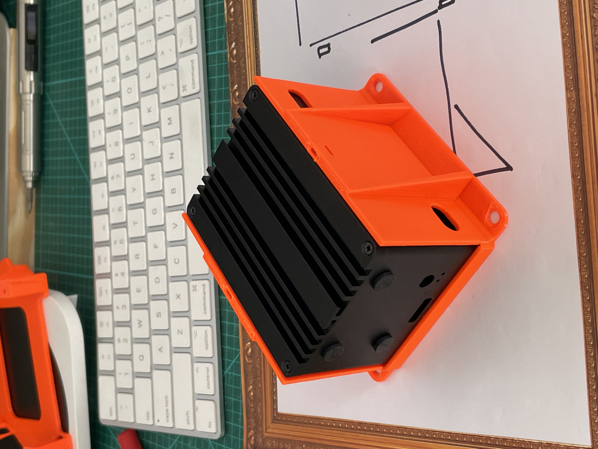
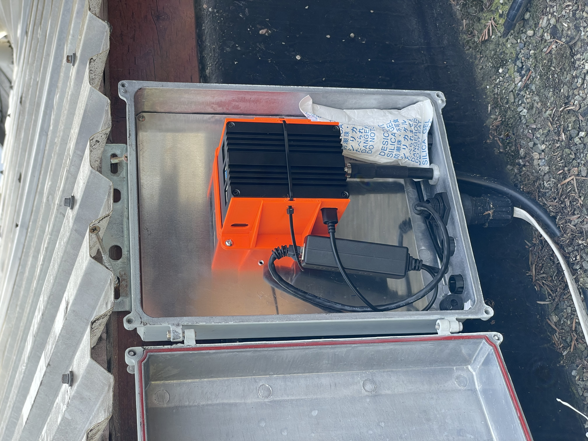

# RAKwireless IoT Hotspot Mount

Designed for 3D Printing.

Note: This file was designed before the pairing button was added to the Hotspot. Modifications may be required based on the SKU being used.

Autodesk file viewer: https://a360.co/48qYcYK

